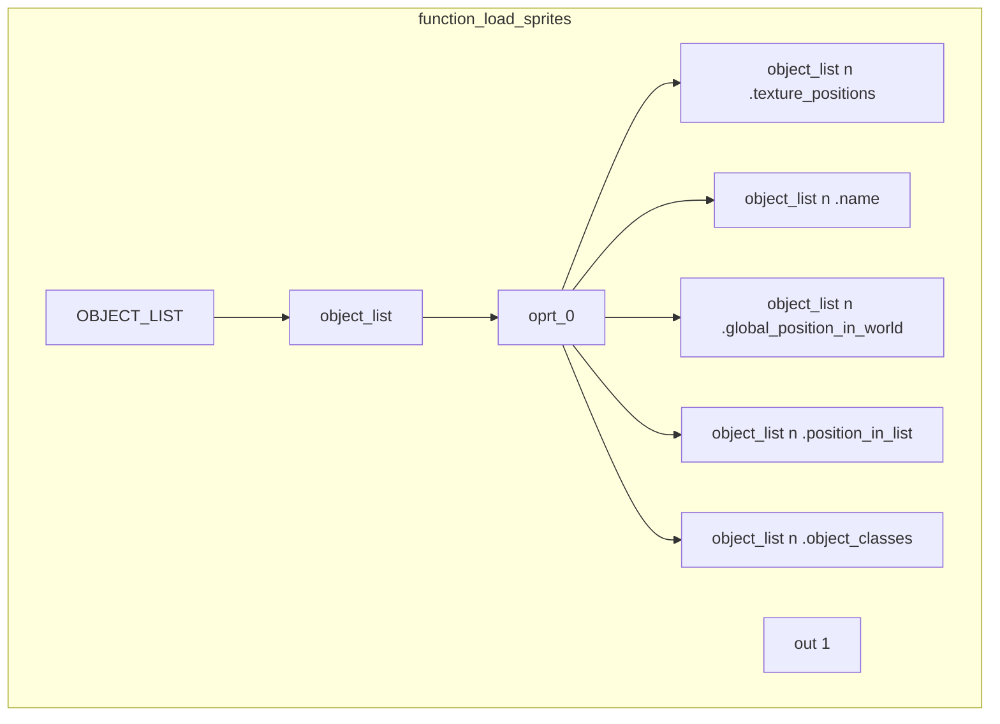

```mermaid
graph TD
    subgraph function_load_sprites
        in_function_load_sprites_1[OBJECT_LIST]
        prty_1[object_list]
        oprt_1[object_list n .texture_positions]
        oprt_2[object_list n .name]
        oprt_3[object_list n .global_position_in_world]
        oprt_4[object_list n .position_in_list]
        oprt_5[object_list n .object_classes]
        out_function_load_sprites_1[out 1]

        in_function_load_sprites_1 --> prty_1
        prty_1 --> oprt_0
        oprt_0 --> oprt_1
        oprt_0 --> oprt_2
        oprt_0 --> oprt_3
        oprt_0 --> oprt_4
        oprt_0 --> oprt_5

    end
```